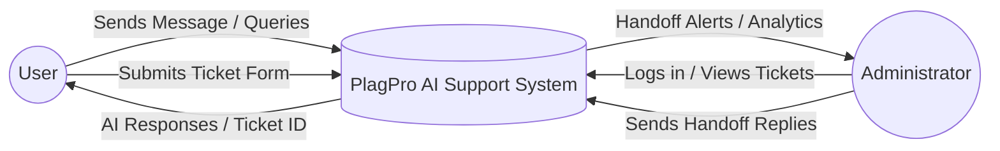
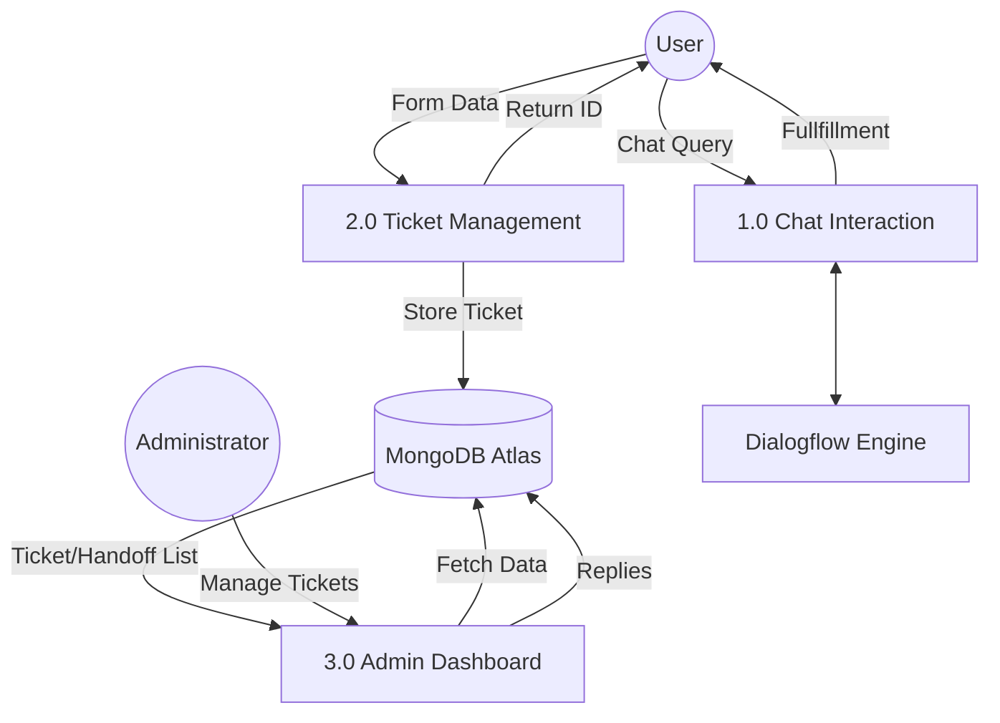
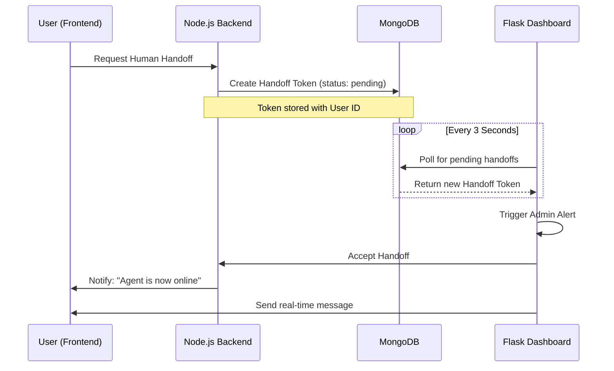
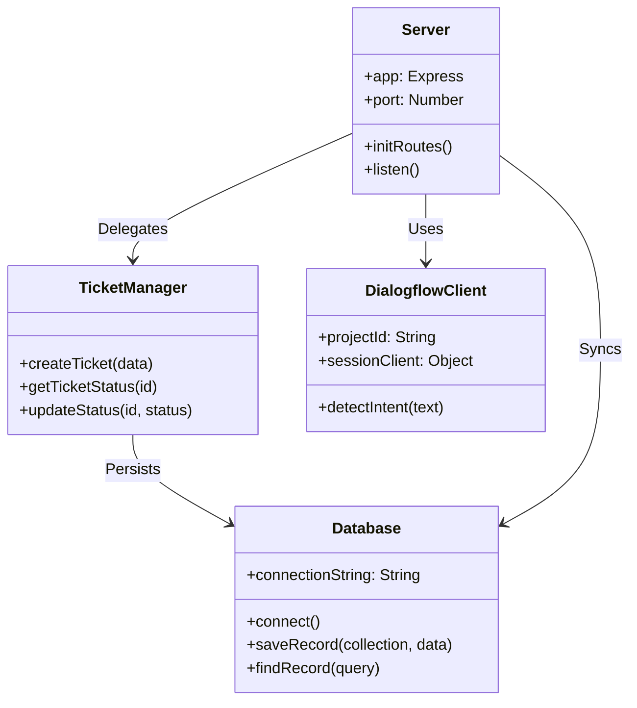
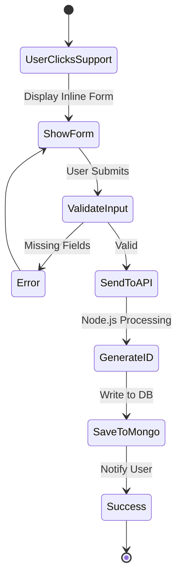
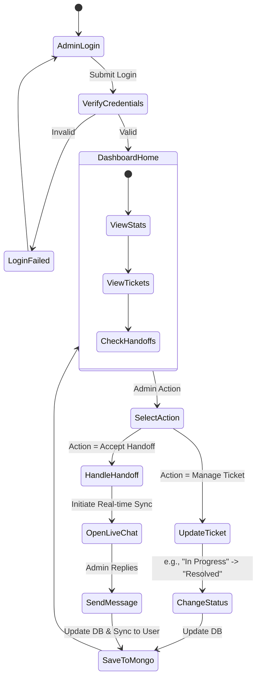

# PlagPro Project Diagram Codes (Mermaid.js)

Copy the code blocks below into the [Mermaid Live Editor](https://mermaid.live/) to generate your project diagrams.

---

## 1. DFD Level 0 (Context Diagram)
**Placement:** Chapter 3, Section 3.8

---

## 2. DFD Level 1 (Process Breakdown)
**Placement:** Chapter 3, Section 3.8

---

## 3. Sequence Diagram (Human Handoff Flow)
**Placement:** Chapter 4, Section 4.2

---

## 4. Class Diagram (System Structure)
**Placement:** Chapter 4, Section 4.2

---

## 5. Activity Diagram (User Ticket Creation)
**Placement:** Chapter 4, Section 4.2

---

## 6. Activity Diagram (Admin Dashboard Flow)
**Placement:** Chapter 4, Section 4.2

